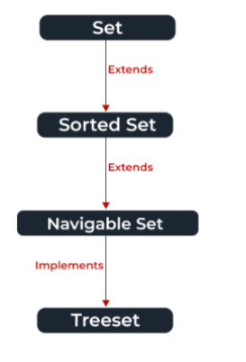

# Java notes

## 1 interface

[Java的Interface到底是什么？ - 知乎 (zhihu.com)](https://zhuanlan.zhihu.com/p/391793123)

https://www.geeksforgeeks.org/interfaces-in-java/

### interface

the core of interface: depart declaration and implementation.

Interface: like a class, the Interface can have methods, variables. declare method by default abstract. Interfaces specify what a class must do and not how.

interface seems like a class inheritance, however when we use inheritance that we only want to use methods. if use inheritance, we have to inherit all of thing in father class, we don't want arguments. so the interface departs the method that it can be used to anywhere else.

for example, class elegant() has method spread_water() while class fish also has method spread_water(). but we can't call spread_water() method single. so we declare a interface: spread_water()

interface spread_water {

​      void spread();

}

for example, a sms service class

````java
public interface SmsService {

  /**
   * 发送短信
   *
   * @param phone 手机号
   * @param msg   信息
   * @return 成功返回true/否则返回false
   */
  boolean sendSms(String phone, String msg);// interface, only declaration
    
  /**
   *the function:
   *boolean sendSms(string phone, string msg){
   *  display();
   *  send();
   }
  */

}
````

````java
// A simple interface
interface Player
{
	final int id = 10;
	int move();
}

````

interface only has a declaration don't implement.

### implements

add method to interface.

simple implement

````java
public class AliSmsService implements SmsService {

  @Override
    // add method sendSms() to interface smsservice
  public boolean sendSms(String phone, String msg) {
    System.out.println("用户的手机号：" + phone); 
    System.out.println("发送的信息是：" + msg);
    System.out.println("AliService 发送短信!");
    return true;
  }
}
````

real-world implement

````java
// 1.interface
public interface SmsService{
    boolean sendSms(String phone, String msg); // method
}

// 2.implement interface AliSmsService and TencentSmsService
public class AliSmsService implements SmsService { //load interface
    @Override
    
    // add implement to interface
    public boolean sendSms(String phone, String msg){ 
        method1();
        method2();
        return 0; // exitation status, 0 is sucessful.
    }
}    
 public class TencentSmsService implements SmsService;// same to above

// msg center, implements two interfaces
public class SmsCenter{
    service list;
    // automatically add ali service
    static {
    serviceSet.add(new AliSmsService());
  }
    
    // a new interface to be called by outside, add service
     public static void addService(SmsService smsService) {
            serviceSet.add(smsService);
  }
     public static void sendSms(String phone, String msg){
         method3();// add method again different to before
     }
}

public class sms{
     public static void main(String[] args) {
          SmsCenter.addService(new TencentSmsService());
          SmsCenter.sendSms("13333333333", "开门！查水表！");
     }
}

````

## 2. set interface

### set interface

set interface is an unordered collection of objects in which duplicate values cannot be stored.

extend set:



**declaration:**

```
public interface Set extends Collection
```

**Creating Set Objects**

```
// Obj is the type of the object to be stored in Set 
Set<Obj> set = new HashSet<Obj> ();
```

**Methods**

`add(element)`

`addAll(collection)`

`clear()`

`contains()`, is used to check whether a specific element is present in the Set or not

`hashCode()`,get the hashCode value for this instance of the Set.

`isEmpty()`, whether the set is empty or not.

`iterator()`

`remove()`


**HashSet**

The **HashSet** class implements the [Set interface](https://www.geeksforgeeks.org/set-in-java/), backed by a hash table which is actually a [HashMap](https://www.geeksforgeeks.org/java-util-hashmap-in-java/) instance

`*HashSet<E> hs = new HashSet<E>();*`


**3. Static Keyword**

the static keyword is used to share the same variable and method of a given class, it belongs to an class than an instance of a class.

````
public static int variable;
````

**4. length vs length()**

**array.length:** length is a final variable applicable for[ arrays](https://www.geeksforgeeks.org/arrays-in-java/). With the help of the length variable, we can obtain the size of the array. 

**string.length() :** length() method is a final variable which is applicable for string objects. The length() method returns the number of characters present in the string

**5. This **

**This** keyword is to eliminate the confusion between attributes and parameters with the same name. This means what is belongs to object itself.

````java
public class Person{
    String name;
    int age;
    double height;
    
    // constructor
    public Person(String name, int age, double height){
        name = name;
        age = age;
        height = height;
    }
    /** one
        name = n;
        age = a;
        height = h;
        
        two
     ** this.name = name;
        this.age = age;
        this.height = height;
     */
    
    public void introduce(){
        System.out.println("my name is"+name,
                           "my age is" + age,
                            " my height is" + height)
    }
}
````


"name", "age" are attributes of the class, "n", "a" are parameters. assign parameters to attributes. but if the name of those are same, the output would be 0. because the name, age are local variable which have higher priority. so it assigns parameter to parameter than attribute. 

this.age means the attribute of this object, so it is correct.

https://www.w3schools.com/java/ref_keyword_this.asp

**6. X? a:b**

if X is true, output a, else b.

````
int a = 0? "Y":"N";
intput a=0
output Y
````

**7. array**

```
// (1) define your java int array
int[] intArray = new int[] {4,5,6,7,8};

// (2) print the java int array
for (int i=0; i<intArray.length; i++)
{
  System.out.println(intArray[i]);
}
```


