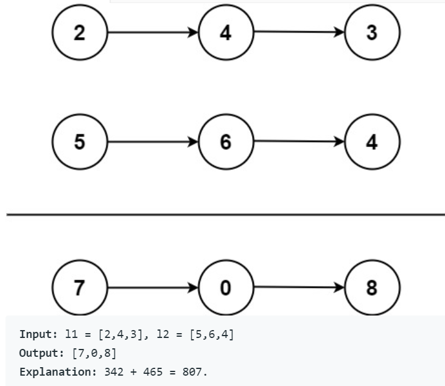
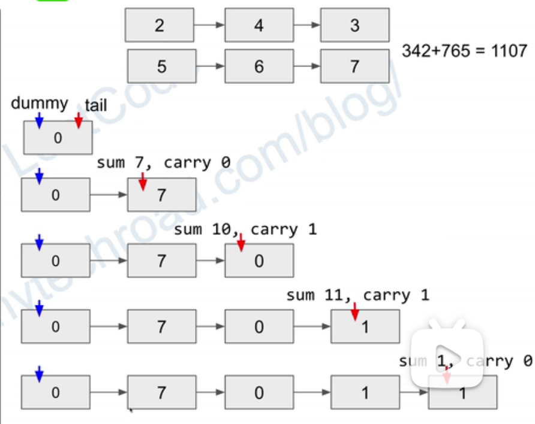

# Leetcode

* [yuanguangxin/LeetCode: LeetCode刷题记录与面试整理 (github.com)](https://github.com/yuanguangxin/LeetCode)
* 

## 1. q1 two sum

https://leetcode.com/problems/two-sum/

**Description:**

intput = [2, 7, 11, 15]   target = 9

output = [0, 1](index)

tips: assume each input would have exactly one solution

**Algorithm:**

* build a hash map, set the element and its index as a key-value pair.
* traversing elements in array one by one. 
* search a pair of elements who were summed up to 9. the traverse has choose a value then to check which element is equals to 9 plus a[i]. 
* return the indices of these two elements.

**code:**

````java
class Solution {
    public int[] twoSum(int[] nums, int target) {
        Map<Integer, Integer> map = new HashMap<>();
        for (int i = 0; i < nums.length; i++) {
            int complement = target - nums[i];
            if (map.containsKey(complement)) {
                return new int[] { map.get(complement), i };// the real return value
            }
            map.put(nums[i], i);// put pair into map
        }
        // In case there is no solution, we'll just return null
        return null;
    }
}
````

**Time Complexity:** O(n)

**Space Complexity:** O(n)

## 2. 387. First Unique Character in a String

**Description:**

find the first non-repeating character in a string  return its index. if not exist, returns -1

```
Input: s = "leetcode" //'aabb'
Output: 0//-1
```

**Algorithm:**

* using hash table, the pair is <character, times>.

* build hash table. get each character from string using a loop and its loop times is string's length.

* record how many times that each character appears. searching key 'c' and add 1 after each time it appears. 

  for one pair, judge if it exists in the hash table. if it doesn't exist, put the c-times to hash table while it returns 0, but adding 1 to 0 as times. if it exists, put the c-times to hash table, but it returns the value of the key, adding 1 to value as times. 

* comparing the value of each key, print the first index of key whose value is 1!

**code:**

````java
class Solution {
    public int firstUniqChar(String s) {
        Map<Character, Integer> map = new HashMap<Character, Integer>();
        int n = s.length();
        for(int i = 0; i < n; i++ ){
            char c = s.charAt(i);
            map.put(c, map.getOrDefault(c,0) + 1 );          
        }
        
        for(int i = 0; i < n; i++ ){
            if (map.get(s.charAt(i)) == 1)
                return i;                
        }     
       return -1; 
    } 
}
````

**Time Complexity:** *O(n)*

**Space Complexity:** *O(1)*

**Tips:**

1. how to get character from a string?

   ````
   charAt():
   String myStr = "Hello";
   char result = myStr.charAt(0);
   ````

2. how to know c does not equals to any of the rest elements?

   * the kv pair is <character, times it appears> rather than  <character, index> .
   * the hashtable is empty, if the key is not exist, return 0 and add 1 to it. if the key exist returns it's value which is the times if appeared previously, then adds 1  to it. 
   * the value equals to 1 meaning it is unique. 

3. Map<Character, Integer> map = new HashMap<Character, Integer>() vs  new HashMap<>?

   there is no influence if deletes Character, Integer in <>?

## 3.q2 Add two numbers

**Description:**



two non-empty linked lists stored in reverse order, return the sum as a linked list.

````
Input: l1 = [2,4,3], l2 = [7,6,4]
Output: [7,0,1,1]
Explanation: 342 + 467 = 1107.
````

**Algorithm:**




**Code:**

````java
/**
 * Definition for singly-linked list.
 * public class ListNode {
 *     int val;
 *     ListNode next;
 *     ListNode() {}
 *     ListNode(int val) { this.val = val; }
 *     ListNode(int val, ListNode next) { this.val = val; this.next = next; }
 * }
 */
class Solution {
    public ListNode addTwoNumbers(ListNode l1, ListNode l2) {
    ListNode dummyHead = new ListNode(0);
    ListNode p = l1, q = l2, curr = dummyHead;
    int carry = 0;
    while (p != null || q != null) {
        int x = (p != null) ? p.val : 0;
        int y = (q != null) ? q.val : 0;
        int sum = carry + x + y;
        carry = sum / 10;
        curr.next = new ListNode(sum % 10);
        curr = curr.next;
        if (p != null) p = p.next;
        if (q != null) q = q.next;
    }
    if (carry > 0) {
        curr.next = new ListNode(carry);
    }
    return dummyHead.next;
    }
}
````


**Time Complexity:**  *O(max(m, n))*

**Space Complexity:** *O(max(m,n))*

**Tips**

1. Linked list + addition simulation. casue the two numbers may in different length even sum would has more digits. e.g 123 + 456789

2. Node = Node.next, must be used to push the node back! otherwise it can't loop.

3. how to imput l1, l2? class linknode means?

   

## 4. q19. Remove Nth Node From End of List

**Description:**

**Algorithm:**

**Code:**

**Time Complexity:** 

**Space Complexity:**

**Tips**


## 5. \25. Reverse Nodes in k-Group

**Description:**

**Algorithm:**

**Code:**

````java
package 链表操作.q25_k个一组翻转链表;

/**
 * 难点在于返回每个部分被修改的头节点，新建一个头节点的前置节点 o(n)
 */
public class Solution {

    public ListNode reverseKGroup(ListNode head, int k) {
        ListNode hair = new ListNode(0); // new null node 
        hair.next = head;  // points to original link

        ListNode pre = hair;
        ListNode end = hair;

        while (end.next != null) {
            for (int i = 0; i < k && end != null; i++){
                end = end.next;
            }
            if (end == null){
                break;
            }
            ListNode start = pre.next;
            ListNode next = end.next;
            end.next = null;
            pre.next = reverse(start);
            start.next = next;
            pre = start;

            end = pre;
        }
        return hair.next;
    }

    private ListNode reverse(ListNode head) {
        ListNode pre = null;
        ListNode curr = head;
        while (curr != null) {
            ListNode next = curr.next;
            curr.next = pre;
            pre = curr;
            curr = next;
        }
        return pre;
    }
}
````


**Time Complexity:** 

**Space Complexity:**

**Tips**

explanation: https://github.com/azl397985856/leetcode/blob/master/problems/25.reverse-nodes-in-k-groups-en.md

## 6. q3 Longest Substring Without Repeating Characters

**Description:**

https://leetcode.com/problems/longest-substring-without-repeating-characters/

**Algorithm:**

用一个 hashmap 来建立字符和其出现位置之间的映射。同时维护一个滑动窗口，窗口内的都是没有重复的字符，去尽可能的扩大窗口的大小，窗口不停的向右滑动。

1. 如果当前遍历到的字符从未出现过，那么直接扩大右边界；

2. 如果当前遍历到的字符出现过，则缩小窗口（左边索引向右移动），然后继续观察当前遍历到的字符；

3. 重复（1）（2），直到窗口内无重复元素；

4. 维护一个全局最大窗口 res，每次用出现过的窗口大小来更新结果 res，最后返回 res 获取结果;

5. 最后返回 res 即可;

   [leetcode/3.longest-substring-without-repeating-characters.md at master · azl397985856/leetcode (github.com)](https://github.com/azl397985856/leetcode/blob/master/problems/3.longest-substring-without-repeating-characters.md)

**Code:**

````java
public class Solution {
    public int lengthOfLongestSubstring(String s) {
        int[] chars = new int[128];

        int left = 0;
        int right = 0;

        int res = 0;
        while (right < s.length()) {
            char r = s.charAt(right);
            chars[r]++;

            while (chars[r] > 1) {
                char l = s.charAt(left);
                chars[l]--; delete the char in window,
                left++;
            }

            res = Math.max(res, right - left + 1);

            right++;
        }
        return res;
    }
}
````


**Time Complexity:** 

**Space Complexity:**

**Tips**

````java 
int[] name = new int[size];
s.charAt(); return the character at thes specified index
````


## 7. q11

**Description:**

**Algorithm:**

[leetcode/11.container-with-most-water.md at master · azl397985856/leetcode (github.com)](https://github.com/azl397985856/leetcode/blob/master/problems/11.container-with-most-water.md)

**Code:**

````java
public class Solution {
    public int maxArea(int[] height) {
        int maxarea = 0, l = 0, r = height.length - 1;
        while (l < r) {
            maxarea = Math.max(maxarea, Math.min(height[l], height[r]) * (r - l));
            if (height[l] < height[r])
                l++;
            else
                r--;
        }
        return maxarea;
    }
}
````


**Time Complexity:** 

**Space Complexity:**

**Tips**

## 8. q15

**Description:**

**Algorithm:**

[leetcode/15.3sum.md at master · azl397985856/leetcode (github.com)](https://github.com/azl397985856/leetcode/blob/master/problems/15.3sum.md)

**Code:**

````java
class Solution {
    public List<List<Integer>> threeSum(int[] nums) {
        List<List<Integer>> rs = new ArrayList<>();

        if (nums.length < 3) {
            return rs;
        }

        Arrays.sort(nums);
        if (nums[0] > 0) {
            return rs;
        }

        for (int i = 0; i < nums.length - 2; i++) {
            if (i > 0 && nums[i] == nums[i - 1]) {
                continue;
            }
            int left = i + 1;
            int right = nums.length - 1;
            while (left < right) {
                int sum = nums[i] + nums[left] + nums[right];
                if (sum == 0) {
                    List<Integer> temp = new ArrayList<>();
                    temp.add(nums[i]);
                    temp.add(nums[left]);
                    temp.add(nums[right]);
                    rs.add(temp);
                    while (left < right && nums[left] == nums[left + 1]) {
                        left++;
                    }
                    while (left < right && nums[right] == nums[right - 1]) {
                        right--;
                    }
                    left++;
                    right--;
                } else if (sum > 0) {
                    right--;
                } else {
                    left++;
                }
            }
        }
        return rs;
    }
}
````


**Time Complexity:** 

**Space Complexity:**

**Tips**

## 9. q141 Linked List Cycle

**Description:**

**Algorithm:**

**Code:**

````java
import java.util.HashSet;
import java.util.Set;

/**
 * 哈希表 o(n)
 */
public class Solution {

    public boolean hasCycle(ListNode head) {
        Set<ListNode> nodesSeen = new HashSet<>();
        while (head != null) {
            if (nodesSeen.contains(head)) {
                return true;
            } else {
                nodesSeen.add(head);
            }
            head = head.next;
        }
        return false;
    }
}
````


````java
/**
 * 快慢指针 o(n)
 */
public class Solution {

    public boolean hasCycle(ListNode head) {
        if (head == null || head.next == null) {
            return false;
        }
        ListNode slow = head;
        ListNode fast = head.next;
        while (slow != fast) {
            if (fast == null || fast.next == null) {
                return false;
            }
            slow = slow.next;
            fast = fast.next.next;
        }
        return true;
    }
}
````


**Time Complexity:** 

**Space Complexity:**

**Tips**

1.hashset: [Java集合比较：HashSet和HashMap的比较 - 知乎 (zhihu.com)](https://zhuanlan.zhihu.com/p/69025075)

2 fast/slow: [快慢指针---不就是快指针走两步慢指针走一步嘛？ - 知乎 (zhihu.com)](https://zhuanlan.zhihu.com/p/372819074)


## 10. q202 Happy Number

**Description:**

**Algorithm:**

**Code:**

````java
public class Solution {

    private int bitSquareSum(int n) {
        int sum = 0;
        while (n > 0) {
            int bit = n % 10;
            sum += bit * bit;
            n = n / 10;
        }
        return sum;
    }

    public boolean isHappy(int n) {
        int slow = n;
        int fast = n;
        do {
            slow = bitSquareSum(slow);
            fast = bitSquareSum(fast);
            fast = bitSquareSum(fast);
        } while (slow != fast);

        return slow == 1;
    }
}
````


**Time Complexity:** 

**Space Complexity:**

**Tips**

## 11. q56 Merge Intervals

**Description:**

**Algorithm:**

**Code:**

````java
class Solution {
    public int[][] merge(int[][] intervals) {
        Arrays.sort(intervals, (a, b) -> Integer.compare(a[0], b[0]));
        LinkedList<int[]> merged = new LinkedList<>(); declare a new linkedlist: merged
        for (int[] interval : intervals) {
            // if the list of merged intervals is empty or if the current
            // interval does not overlap with the previous, simply append it.
            if (merged.isEmpty() || merged.getLast()[1] < interval[0]) {
                merged.add(interval);
            }
            // otherwise, there is overlap, so we merge the current and previous
            // intervals.
            else {
                merged.getLast()[1] = Math.max(merged.getLast()[1], interval[1]);
            }
        }
        return merged.toArray(new int[merged.size()][]);
    }
}
````


**Time Complexity:** 

**Space Complexity:**

**Tips**

1 **Syntax:** 

```
for (type var : array) 
{ 
    statements using var;
}
```

**is equivalent to:** 
 

```
for (int i=0; i<arr.length; i++) 
{ 
    type var = arr[i];
    statements using var;
}
```

2. ArrayList

   [Java ArrayList | 菜鸟教程 (runoob.com)](https://www.runoob.com/java/java-arraylist.html)

3. 2 demsional array

   https://www.geeksforgeeks.org/arraylist-toarray-method-in-java-with-examples/

   4for each loop

   [leetcode/56.merge-intervals.md at master · azl397985856/leetcode (github.com)](https://github.com/azl397985856/leetcode/blob/master/problems/56.merge-intervals.md)

## 12. q\6. Zigzag Conversion

**Description:**

**Algorithm:**

**Code:**

````java
class Solution {
    public String convert(String s, int numRows) {

        if (numRows == 1) return s;

        StringBuilder ret = new StringBuilder();
        int n = s.length();
        int cycleLen = 2 * numRows - 2;

        for (int i = 0; i < numRows; i++) {
            for (int j = 0; j + i < n; j += cycleLen) {
                ret.append(s.charAt(j + i));
                if (i != 0 && i != numRows - 1 && j + cycleLen - i < n)
                    ret.append(s.charAt(j + cycleLen - i));
            }
        }
        return ret.toString();
    }
}
````


**Time Complexity:** 

**Space Complexity:**

**Tips**

https://senliuy.gitbook.io/leetcode/di-liu-zhang-ff1a-shu-xue/q6-zigzag-conversion

## 13. q14 Longest Common Prefix

**Description:**

**Algorithm:**

**Code:**

````java
 public String longestCommonPrefix(String[] strs) {
    if (strs.length == 0) return "";
    String prefix = strs[0];
    for (int i = 1; i < strs.length; i++)
        while (strs[i].indexOf(prefix) != 0) {
            prefix = prefix.substring(0, prefix.length() - 1);
            if (prefix.isEmpty()) return "";
        }        
    return prefix;
}
````


**Time Complexity:** 

**Space Complexity:**

**Tips**

## 14. q7 Reverse Integer

**Description:**

**Algorithm:**

**Code:**

````java
class Solution {
    public int reverse(int x) {
        int rev = 0;
        while (x != 0) {
            int pop = x % 10;
            x /= 10;
            if (rev > Integer.MAX_VALUE/10 || (rev == Integer.MAX_VALUE / 10 && pop > 7)) return 0;
            if (rev < Integer.MIN_VALUE/10 || (rev == Integer.MIN_VALUE / 10 && pop < -8)) return 0;
            rev = rev * 10 + pop;
        }
        return rev;
    }
}
````


**Time Complexity:** 

**Space Complexity:**

**Tips**


## 15. q8 String to Integer (atoi)

**Description:**

**Algorithm:**

**Code:**

````java
class Solution {
    public int myAtoi(String input) {
        int sign = 1; 
        int result = 0; 
        int index = 0;
        int n = input.length();
        
        // Discard all spaces from the beginning of the input string.
        while (index < n && input.charAt(index) == ' ') { 
            index++; 
        }
        
        // sign = +1, if it's positive number, otherwise sign = -1. 
        if (index < n && input.charAt(index) == '+') {
            sign = 1;
            index++;
        } else if (index < n && input.charAt(index) == '-') {
            sign = -1;
            index++;
        }
        
        // Traverse next digits of input and stop if it is not a digit
        while (index < n && Character.isDigit(input.charAt(index))) {
            int digit = input.charAt(index) - '0';

            // Check overflow and underflow conditions. 
            if ((result > Integer.MAX_VALUE / 10) || 
                (result == Integer.MAX_VALUE / 10 && digit > Integer.MAX_VALUE % 10)) {     
                // If integer overflowed return 2^31-1, otherwise if underflowed return -2^31.    
                return sign == 1 ? Integer.MAX_VALUE : Integer.MIN_VALUE;
            }
            
            // Append current digit to the result.
            result = 10 * result + digit;
            index++;
        }
        
        // We have formed a valid number without any overflow/underflow.
        // Return it after multiplying it with its sign.
        return sign * result;
    }
}
````


**Time Complexity:** 

**Space Complexity:**

**Tips**

1 ascii: https://www.ibm.com/docs/en/sdse/6.4.0?topic=configuration-ascii-characters-from-33-126

## 16. q9 Palindrome Number

**Description:**

**Algorithm:**

**Code:**

````java
public class Solution {
    public boolean isPalindrome(int x) {
        if (x < 0) {
            return false;
        }
        if (x < 10) {
            return true;
        }
        if (x % 10 == 0) {
            return false;
        }
        int rs = 0;
        while (rs < x / 10) {
            int y = x % 10;
            x = x / 10;
            rs = rs * 10 + y;
            if (rs == x) {
                return true;
            } else if (x / 10 == rs) {
                return true;
            }
        }
        return false;
    }
}
````


**Time Complexity:** 

**Space Complexity:**

**Tips**

## 17. q54 Spiral Matrix

**Description:**

**Algorithm:**

**Code:**

````java
public class Solution {

    public List<Integer> spiralOrder(int[][] matrix) {
        List<Integer> rs = new ArrayList<>();
        if (matrix.length == 0 || matrix[0].length == 0) {
            return rs;
        }
        int m = matrix.length;
        int n = matrix[0].length;
        boolean[][] visited = new boolean[m][n];

        int i = 0;
        int j = 0;
        int direction = 1;
        while (true) {
            if (i < 0 || j < 0 || i == m || j == n || visited[i][j]) {
                break;
            }
            rs.add(matrix[i][j]);
            visited[i][j] = true;
            switch (direction) {
                case 1:
                    if (j + 1 == n || visited[i][j + 1]) {
                        i++;
                        direction = 2;
                    } else {
                        j++;
                    }
                    break;
                case 2:
                    if (i + 1 == m || visited[i + 1][j]) {
                        j--;
                        direction = 3;
                    } else {
                        i++;
                    }
                    break;
                case 3:
                    if (j == 0 || visited[i][j - 1]) {
                        i--;
                        direction = 4;
                    } else {
                        j--;
                    }
                    break;
                case 4:
                    if (visited[i - 1][j]) {
                        j++;
                        direction = 1;
                    } else {
                        i--;
                    }
                    break;
                default:
                    break;
            }
        }
        return rs;
    }

    public static void main(String[] args) {
        System.out.println(new Solution().spiralOrder(new int[][]{{1, 2, 3}, {4, 5, 6}, {7, 8, 9}}));
    }
}
````


**Time Complexity:** 

**Space Complexity:**

**Tips**

## 18. q581  Shortest Unsorted Continuous Subarray

**Description:**

**Algorithm:**

**Code:**

````java
class Solution {

    public int findUnsortedSubarray(int[] nums) {
        if (nums == null || nums.length < 1) {
            return 0;
        }

        int[] cloneNums = nums.clone();
        Arrays.sort(nums);

        int begin = Integer.MAX_VALUE;
        int end = 0;
        for (int i = 0; i < nums.length; i++) {
            if (nums[i] != cloneNums[i]) {
                begin = Math.min(begin, i);
                end = Math.max(end, i);
            }
        }
        return Math.max(end - begin + 1, 0);
    }

    public static void main(String[] args) {
        new Solution().findUnsortedSubarray(new int[]{2, 6, 4, 8, 10, 9, 15});
    }
}
````


**Time Complexity:** 

**Space Complexity:**

**Tips**

## 19. q20 Valid Parentheses

**Description:**

**Algorithm:**

**Code:**

````java
class Solution {
    public boolean isValid(String s) {
        Stack<Character> stack = new Stack<>();
        for (int i = 0; i < s.length(); i++) {
            char t = s.charAt(i);
            if (t == '(' || t == '[' || t == '{') {
                stack.push(t);
            } else {
                if (stack.empty()) {
                    return false;
                }
                if (t == ')') {
                    if (stack.pop() != '(') {
                        return false;
                    }
                } else if (t == ']') {
                    if (stack.pop() != '[') {
                        return false;
                    }
                } else {
                    if (stack.pop() != '{') {
                        return false;
                    }
                }
            }
        }
        return stack.empty();
    }

    public static void main(String[] args) {
        System.out.println(new Solution().isValid("()"));
    }
}
````


**Time Complexity:** 

**Space Complexity:**

**Tips**

## 20. q316 Remove Duplicate Letters

**Description:**

**Algorithm:**

**Code:**

````java
class Solution {

    public String removeDuplicateLetters(String s) {
        Stack<Character> stack = new Stack<>();
        for (int i = 0; i < s.length(); i++) {
            Character c = s.charAt(i);
            if (stack.contains(c)) {
                continue;
            }
            while (!stack.isEmpty() && stack.peek() > c && s.indexOf(stack.peek(), i) != -1) {
                stack.pop();
            }
            stack.push(c);
        }
        String rs = "";
        for (int i = 0; i < stack.size(); i++) {
            rs += stack.get(i);
        }
        return rs;
    }
}
````


**Time Complexity:** 

**Space Complexity:**

**Tips**

## 21. q215 Kth Largest Element in an Array

**Description:**

**Algorithm:**

[leetcode/215.kth-largest-element-in-an-array.md at master · azl397985856/leetcode (github.com)](https://github.com/azl397985856/leetcode/blob/master/problems/215.kth-largest-element-in-an-array.md)

**Code:**

````java
public class Solution {

    public int findKthLargest(int[] nums, int k) {
        PriorityQueue<Integer> heap =
                new PriorityQueue<>((n1, n2) -> n1 - n2);

        for (int n: nums) {
            heap.add(n);
            if (heap.size() > k){
                heap.poll();
            }
        }

        return heap.poll();
    }
}
````


**Time Complexity:** 

**Space Complexity:**

**Tips**


[(3条消息) 数据结构学习笔记（一）：Heap_u011089243的专栏-CSDN博客](https://blog.csdn.net/u011089243/article/details/54890452)

## 22. q21 Merge Two Sorted Lists

**Description:**

**Algorithm:**

**Code:**

````java
/**
 * Definition for singly-linked list.
 * public class ListNode {
 *     int val;
 *     ListNode next;
 *     ListNode() {}
 *     ListNode(int val) { this.val = val; }
 *     ListNode(int val, ListNode next) { this.val = val; this.next = next; }
 * }
 */
class Solution {
    public ListNode mergeTwoLists(ListNode l1, ListNode l2) {
       ListNode temp_node = new ListNode(0);
       ListNode current_node = temp_node;
           
       while(l1 != null && l2 != null){
           if (l1.val<l2.val){
               current_node.next = l1;
               l1=l1.next;
           }else{
               current_node.next = l2;
               l2 = l2.next;
           }
           
           current_node = current_node.next;
       }
        
        if (l1 != null){
            current_node.next = l1;
            l1=l1.next;
        }
        
        if (l2 != null){
            current_node.next = l2;
            l2=l2.next;
        }
       
       return temp_node.next;
      }
}
````


**Time Complexity:** 

**Space Complexity:**

**Tips**

this one we're doing is called merge two sorted lists and it's a linked list problem. it's not just like a race or anything so we basically just are given two list nodes as you can see right here we got l1 and l2 . these are our list nodes and we want to create one final linked list that contains all the nodes of both of these linked lists and it all has to be sorted the whole way. so what we're gonna want to do the method for this is we're gonna want to traverse both the lists we're gonna want to make a new head node so we'll have our own R . we're gonna make our own list our own separate list so we're gonna create our new our own head node and then we're just going to set the next node to the smaller value of the both of these nodes. as we traverse both of them right because we want it in order so that's pretty much the concept behind it you'll see what we do.

as we go through it I'm gonna cut it out right here. so while this node temp node is equal to new list node 0. this is kind of our just like beginner node. there's always this thing when you doing linked list problems where you can have like kind of a temp node just to hold the heads place. so as we do all this at the very end we can just return temp node next and get the actual head that we need.

so we'll do list node current node this is the node we're actually going to be using as equal to some node so while l1 is not equal to null and l2 is not evil no because we'll be traversing these lists if l1 Bao is greater than L 2 dot Val then we're gonna want to use l2 because we want the smaller value as we go first so current node dot next this means the l2 is smaller we could have written in a different way so actually let's do it this way if l1 is less than L 2 then we'll do current node X is equal to l1 because we want l1 the smaller one and then l1 he goes all undone next because we got to keep traversing down or you know looping through these lists otherwise we'll set the opposite current node X is equal to L 2 that means L 2 is smaller L 2 equals L 2 dot next and that's pretty much it as we loop through soup pretty easy problem and then you have to obviously update the current node so current node equals current node dot next only thing is when we get to the you can get to the end of this loop where L one of these this condition can be broken because one of them could get to the end and the other one might not be at the end so we just have to account for those ending little edge cases so if L one's not even all and what say L 2 was and we broke out of this loop we just do current node dot next just to get that last out one node single dial 1 L 1 equals L 1 dot next and then we have that same kind of thing for L 2 just the last check current node X equal to L 2 and L 2 equals L 2 dot next and then we're done we're done all we have to do is return like I said at the beginning temp node next time node is just an empty list node so the next node is because current node set to temp node time now is just an empty list node but current node dot next well as soon as we start this loop current node X is going to be l1 or l2 our first actual node and this after you do all this it's going to come out and sort an order perfect problem solution hopefully first try its first try very good that's the whole solution right there not too bad not too bad one thing goes soo bad so thank you guys for watching please check out the other videos gonna be doing probably a lot of linked list ones today so all right

https://www.youtube.com/watch?v=KVf1Uuqfv8E


## 23. q226 Invert Binary Tree

**Description:**

**Algorithm:**

**Code:**

````java
** treenode**
public class TreeNode {
    int val;
    TreeNode left;
    TreeNode right;

    TreeNode(int x) {
        val = x;
    }
}


** invert tree**
/**
 * Definition for a binary tree node.
 * public class TreeNode {
 *     int val;
 *     TreeNode left;
 *     TreeNode right;
 *     TreeNode() {}
 *     TreeNode(int val) { this.val = val; }
 *     TreeNode(int val, TreeNode left, TreeNode right) {
 *         this.val = val;
 *         this.left = left;
 *         this.right = right;
 *     }
 * }
 */
class Solution {
    public TreeNode invertTree(TreeNode root) {
        if (root == null) {
            return null;
        }
        TreeNode right = invertTree(root.right);
        TreeNode left = invertTree(root.left);
        root.left = right;
        root.right = left;
        return root;
    }
}
````


**Time Complexity:** 

**Space Complexity:**

**Tips**

recursion: [二叉树（binary tree）的递归套路 - 知乎 (zhihu.com)](https://zhuanlan.zhihu.com/p/148010150)

https://leetcode.com/problems/invert-binary-tree/

## 24. q34 . Find First and Last Position of Element in Sorted Array

**Description:**

**Algorithm:**

**Code:**

````java
public class Solution {

    public int[] searchRange(int[] nums, int target) {
        if (nums == null || nums.length < 1) {
            return new int[]{-1, -1};
        }
        int midIndex = find(0, nums.length - 1, nums, target);
        int[] rs = new int[2];
        rs[0] = midIndex;
        rs[1] = midIndex;
        if (midIndex == -1) {
            return rs;
        }
        while (nums[rs[0]] == target && rs[0] > 0) {
            int temp = find(0, rs[0] - 1, nums, target);
            if (temp == -1) {
                break;
            } else {
                rs[0] = temp;
            }
        }

        while (nums[rs[1]] == target && rs[1] < nums.length - 1) {
            int temp = find(rs[1] + 1, nums.length - 1, nums, target);
            if (temp == -1) {
                break;
            } else {
                rs[1] = temp;
            }
        }
        return rs;
    }

    public int find(int beginIndex, int endIndex, int[] nums, int target) {
        if (beginIndex == endIndex) {
            if (nums[beginIndex] == target) {
                return beginIndex;
            } else {
                return -1;
            }
        }
        int mid = (endIndex - beginIndex) / 2 + beginIndex;
        if (nums[mid] > target) {
            return find(beginIndex, mid, nums, target);
        } else if (nums[mid] < target) {
            return find(mid + 1, endIndex, nums, target);
        } else {
            return mid;
        }
    }

    public static void main(String[] args) {
        new Solution().searchRange(new int[]{2, 2}, 2);
    }
}
````


**Time Complexity:** 

**Space Complexity:**

**Tips**

## 25. q5 Longest Palindromic Substring

**Description:**

**Algorithm:**

**Code:**

````java
class Solution {

    public String getPalindrome(String s, int index) {
        String rs = "";
        int sLen = s.length();
        int i = index;
        int j = index;
        while (j < sLen) {
            if (s.charAt(j) == s.charAt(index)) {
                rs = rs + s.charAt(j);
                j++;
            } else {
                break;
            }
        }
        i--;
        while (i >= 0 && j < sLen) {
            if (s.charAt(i) == s.charAt(j)) {
                rs = s.charAt(i) + rs;
                rs = rs + s.charAt(i);
                i--;
                j++;
            } else {
                break;
            }
        }
        return rs;
    }

    public String longestPalindrome(String s) {
        int maxLen = -1;
        String rs = "";
        for (int i = 0; i < s.length(); i++) {
            String t = getPalindrome(s, i);
            if (t.length() > maxLen) {
                maxLen = t.length();
                rs = t;
            }
        }
        return rs;
    }
}
````


**Time Complexity:** 

**Space Complexity:**

**Tips**

https://leetcode.com/problems/longest-palindromic-substring/

## 26. q118 Pascal's Triangle

**Description:**

https://leetcode.com/problems/pascals-triangle/

**Algorithm:**

**Code:**

````java
public class Solution {

    public List<List<Integer>> generate(int numRows) {
        List<List<Integer>> triangle = new ArrayList<List<Integer>>();

        if (numRows == 0) {
            return triangle;
        }

        triangle.add(new ArrayList<>());
        triangle.get(0).add(1);

        for (int rowNum = 1; rowNum < numRows; rowNum++) {
            List<Integer> row = new ArrayList<>();
            List<Integer> prevRow = triangle.get(rowNum-1);
            row.add(1);

            for (int j = 1; j < rowNum; j++) {
                row.add(prevRow.get(j-1) + prevRow.get(j));
            }

            row.add(1);
            triangle.add(row);
        }
        return triangle;
    }
}
````


**Time Complexity:** 

**Space Complexity:**

**Tips**

https://www.youtube.com/watch?v=icoql2WKmbA

***回溯法***

## 27. q10  Regular Expression Matching

**Description:**

https://leetcode.com/problems/regular-expression-matching/


**Algorithm:**

**Code:**

````java
public class Solution {
    public boolean isMatch(String text, String pattern) {
        if (pattern.isEmpty()){
            return text.isEmpty();
        }
        boolean firstMatch = (!text.isEmpty() &&
                (pattern.charAt(0) == text.charAt(0) || pattern.charAt(0) == '.'));

        if (pattern.length() >= 2 && pattern.charAt(1) == '*') {
            return (isMatch(text, pattern.substring(2)) ||
                    (firstMatch && isMatch(text.substring(1), pattern)));
        } else {
            return firstMatch && isMatch(text.substring(1), pattern.substring(1));
        }
    }

    public static void main(String[] args) {
        System.out.println(new Solution().isMatch("aaa", "a*a"));
    }
}
````


**Time Complexity:** 

**Space Complexity:**

**Tips**


***dictionary***

## 28. q648 \648. Replace Words

**Description:**

**Algorithm:**

**Code:**

````java
class Solution {
    public String replaceWords(List<String> roots, String sentence) {
        TrieNode trie = new TrieNode();
        for (String root : roots) {
            TrieNode cur = trie;
            for (char letter : root.toCharArray()) {
                if (cur.children[letter - 'a'] == null) {
                    cur.children[letter - 'a'] = new TrieNode();
                }
                cur = cur.children[letter - 'a'];
            }
            cur.word = root;
        }

        StringBuilder ans = new StringBuilder();

        for (String word : sentence.split(" ")) {
            if (ans.length() > 0) {
                ans.append(" ");
            }

            TrieNode cur = trie;
            for (char letter : word.toCharArray()) {
                if (cur.children[letter - 'a'] == null || cur.word != null) {
                    break;
                }
                cur = cur.children[letter - 'a'];
            }
            ans.append(cur.word != null ? cur.word : word);
        }
        return ans.toString();
    }
}

class TrieNode {
    TrieNode[] children;
    String word;

    TrieNode() {
        children = new TrieNode[26];
    }
}
````


**Time Complexity:** 

**Space Complexity:**

**Tips**


***tree traverse***

## 29. q94 

**Description:**

**Algorithm:**

**Code:**

````java
public class Solution {
    public List<Integer> inorderTraversal(TreeNode root) {
        List<Integer> rs = new ArrayList<>();
        Stack<TreeNode> stack = new Stack<>();
        while (!stack.empty() || root != null) {
            while (root != null) {
                stack.push(root);
                root = root.left;
            }
            root = stack.pop();
            rs.add(root.val);
            root = root.right;
        }
        return rs;
    }
}
````


**Time Complexity:** 

**Space Complexity:**

**Tips**

## 30. q144

**Description:**

**Algorithm:**

**Code:**

````java
public class Solution {
    public List<Integer> preorderTraversal(TreeNode root) {
        List<Integer> rs = new ArrayList<>();
        Stack<TreeNode> stack = new Stack<>();
        while (!stack.empty() || root != null) {
            while (root != null) {
                rs.add(root.val);
                stack.push(root);
                root = root.left;
            }
            root = stack.pop();
            root = root.right;
        }
        return rs;
    }

    public static void main(String[] args) {
        TreeNode root = new TreeNode(1);
        TreeNode t1 = new TreeNode(2);
        root.right = t1;
        TreeNode t2 = new TreeNode(3);
        t1.left = t2;
        new Solution().preorderTraversal(root);
    }
}
````


**Time Complexity:** 

**Space Complexity:**

**Tips**

## 31. q450

**Description:**

**Algorithm:**

**Code:**

````java
public class Solution {
    public TreeNode deleteNode(TreeNode root, int key) {
        if (root == null) {
            return null;
        }

        if (key < root.val) {
            root.left = deleteNode(root.left, key);
            return root;
        }
        if (key > root.val) {
            root.right = deleteNode(root.right, key);
            return root;
        }

        if (root.left == null) {
            return root.right;
        }

        if (root.right == null) {
            return root.left;
        }
        //求前驱节点
        TreeNode predecessor = maximum(root.left);
        TreeNode predecessorCopy = new TreeNode(predecessor.val);
        //先remove再衔接
        predecessorCopy.left = removeMax(root.left);
        predecessorCopy.right = root.right;
        root.left = null;
        root.right = null;
        return predecessorCopy;
    }

    /**
     * 两种情况，一种 node.right == null 说明前驱节点为删除节点的左节点，否则为删除节点的右侧叶节点（对应maximum(root.left)）
     *
     * @param node
     * @return
     */
    private TreeNode removeMax(TreeNode node) {
        if (node.right == null) {
            return node.left;
        }
        node.right = removeMax(node.right);
        return node;
    }

    private TreeNode maximum(TreeNode node) {
        if (node.right == null) {
            return node;
        }
        return maximum(node.right);
    }

    public static void main(String[] args) {
        TreeNode root = new TreeNode(1);
//        TreeNode n1 = new TreeNode(3);
        TreeNode n2 = new TreeNode(2);
//        TreeNode n3 = new TreeNode(2);
//        TreeNode n4 = new TreeNode(4);
//        TreeNode n5 = new TreeNode(7);
//
//        root.left = n1;
        root.right = n2;
//        n1.left = n3;
//        n1.right = n4;
//        n2.right = n5;

        new Solution().deleteNode(root, 1);
    }
}
````


**Time Complexity:** 

**Space Complexity:**

**Tips**
