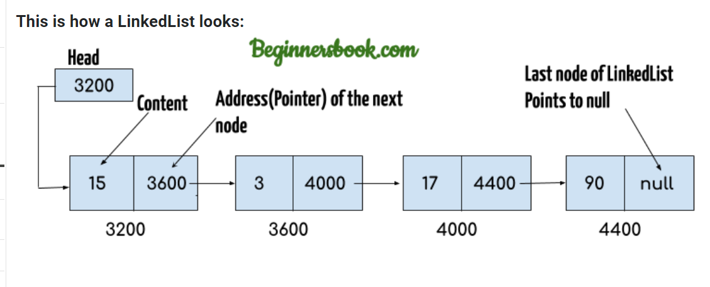
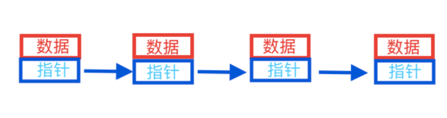
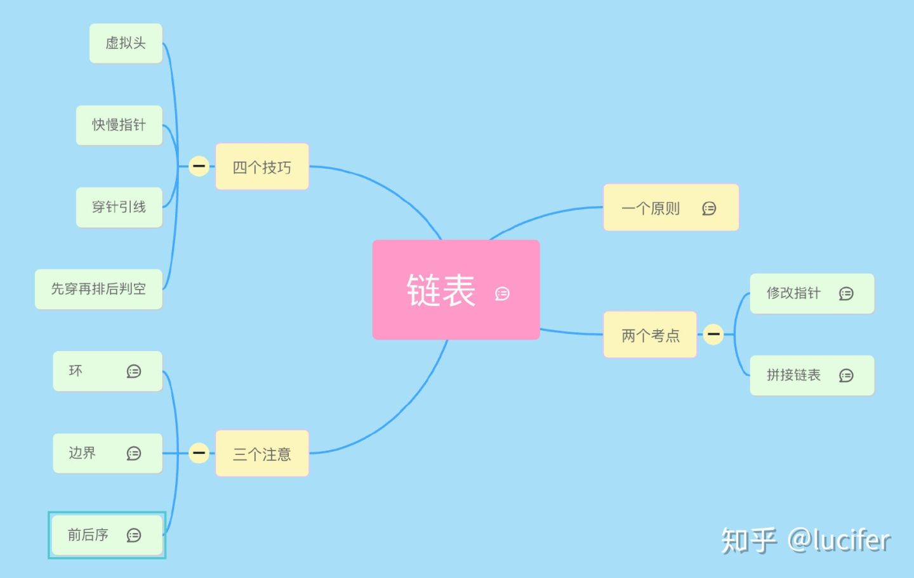
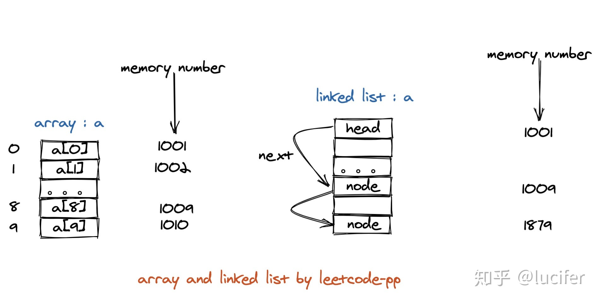

# Linked Lists

**Linked list:** consist of data and pointer, while the pointer points to next node.

**Singly Linked List** (SLL)




**Head:** address of the first element.

**Last Node:** point to null which is the end of the link.

**Pointer:** Address of the next node.

**SLL:** This is a singly linked list, also there is a doubly linked list.



**Class Node**

````java
//Class node having Generic data-type <T>
public class Node<T> {
  public T data; //Data to store (could be int, string, Object etc)
  public Node nextNode; //Pointer to next node in list
}
````

**Class Linked list**

````java
public class SinglyLinkedList<T> {
    //Node inner class for SLL
    public class Node{
        public T data; //Data to store (could be int, string, Object etc)
        public Node nextNode; //Pointer to next node in list

    }

    public Node headNode; //head node of the linked list
    public int size;      //size of the list

    //constructor
    public SinglyLinkedList() {
        headNode = null;
        size = 0;
    }
}
````

**Methods**

````
insertAtEnd(data)	Inserts an element at the end of the linked list
insertAtHead(data)	Inserts an element at the start/head of the linked list
delete(data)	Deletes an element from the linked list
deleteAtHead()	Deletes the first element of the list
deleteAtEnd()	Deletes the last element of the list
Search(data)	Searches an element from the linked list
isEmpty()
````

**Linked List**

````java
import java.util.*;
public class LinkedList{
   public static void main(String args[]){

     LinkedList<String> list=new LinkedList<String>();

     //Adding elements to the Linked list
     list.add("Steve");
     list.add("Carl");
     list.add("Raj");

     //Adding an element to the first position
     list.addFirst("Negan");

     //Adding an element to the last position
     list.addLast("Rick");

     //Adding an element to the 3rd position
     list.add(2, "Glenn");

     //Iterating LinkedList
     Iterator<String> iterator=list.iterator();
     while(iterator.hasNext()){
       System.out.println(iterator.next());// N S G C R Rick
     }
     
      //removing 2nd element, index starts with 0
      list.remove(1);
   } 
} 


````

**java ListNode :**

````java
class ListNode {        //类名 ：Java类就是一种自定义的数据结构
    int val;            //数据 ：节点数据 
    ListNode next;      //对象 ：引用下一个节点对象。在Java中没有指针的概念，Java中的引用和C语言的指针类似
    
    ListNode(int val){  //构造方法 ：构造方法和类名相同   
    this.val=val;     //把接收的参数赋值给当前类的val变量
}
````

**Create and traverse linked list with insert, replace, delete**

````java
class ListNode {        //类名 ：Java类就是一种自定义的数据结构
    int val;            //数据 ：节点数据 
    ListNode next;      //对象 ：引用下一个节点对象。在Java中没有指针的概念，Java中的引用和C语言的指针类似
    
    ListNode(int val){  //构造方法 ：构造方法和类名相同   
        this.val=val;   //把接收的参数赋值给当前类的val变量
    }
}

class Test{
    public static void main(String[] args){
        
        ListNode nodeSta = new ListNode(0);    //创建首节点
        ListNode nextNode;                     //声明一个变量用来在移动过程中指向当前节点
        nextNode=nodeSta;                      //指向首节点

        //创建链表
        for(int i=1;i<10;i++){
            ListNode node = new ListNode(i);  //生成新的节点
            nextNode.next=node;               //把心节点连起来
            nextNode=nextNode.next;           //当前节点往后移动
        } //当for循环完成之后 nextNode指向最后一个节点，
        
        nextNode=nodeSta;                     //重新赋值让它指向首节点
        print(nextNode);                      //打印输出
        
         //插入节点
        while(nextNode!=null){
            if(nextNode.val==5){
                ListNode newnode = new ListNode(99);  //生成新的节点
                ListNode node=nextNode.next;          //先保存下一个节点
                nextNode.next=newnode;                //插入新节点
                newnode.next=node;                    //新节点的下一个节点指向 之前保存的节点
            }
            nextNode=nextNode.next;
        }//循环完成之后 nextNode指向最后一个节点
        nextNode=nodeSta;                            //重新赋值让它指向首节点
        print(nextNode);                             //打印输出
        
        //替换节点
        while(nextNode!=null){
            if(nextNode.val==4){
                ListNode newnode = new ListNode(99);  //生成新的节点
                ListNode node=nextNode.next.next;     //先保存要替换节点的下一个节点
                nextNode.next.next=null;              //被替换节点 指向为空 ，等待java垃圾回收
                nextNode.next=newnode;                //插入新节点
                newnode.next=node;                    //新节点的下一个节点指向 之前保存的节点
            }
            nextNode=nextNode.next;
        }//循环完成之后 nextNode指向最后一个节点
         nextNode=nodeSta;                            //重新赋值让它指向首节点
         print(nextNode);                             //打印输出
        
        //删除节点
        while(nextNode!=null){
            if(nextNode.val==5){
                ListNode listNode=nextNode.next.next;     //保存要删除节点的下一个节点
                nextNode.next.next=null;                  //被删除节点 指向为空 ，等待java垃圾回收
                nextNode.next=listNode;                   //指向要删除节点的下一个节点
            }
            nextNode=nextNode.next;
        }//循环完成之后 nextNode指向最后一个节点
         nextNode=nodeSta;                            //重新赋值让它指向首节点
         print(nextNode);                             //打印输出
    }
    
      
    }
    
    //打印输出方法
    static void print(ListNode listNoed){
        //创建链表节点
        while(listNoed!=null){
            System.out.println("节点:"+listNoed.val);
            listNoed=listNoed.next;
        }
        System.out.println();
    }
}
   
}
````

**Linked list knowledge points**



**the difference of Memory for Array and Linked list**



**two key points in leetcode**

1. change pointer
2. linked list splicing

https://beginnersbook.com/2013/12/linkedlist-in-java-with-example/

[java ListNode 链表 - 一文搞懂 - 博客园 (cnblogs.com)](https://www.cnblogs.com/easyidea/p/13371863.html)

[几乎刷完了力扣所有的链表题，我发现了这些东西。。。 - 知乎 (zhihu.com)](https://zhuanlan.zhihu.com/p/281404491)